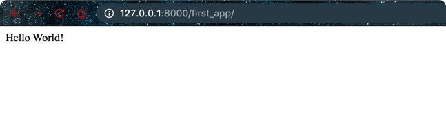

- Add the following to the project's `urls.py`. This would allow us to look for any url that has the
  pattern: `www.domainname.com/first_apps/...`

```python
from django.conf.urls import include
from django.conf.urls import url

urlpatterns = [
    url(r'^first_app/',include('first_app.urls')),
]
```

- Now add the following file to your new app i.e. `first_app/urls.py`
```python
from django.conf.urls import url
from first_app import views

urlpatterns = [
    url(r'^$', views.index, name='index'),
]
```


