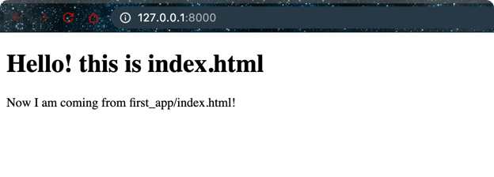

### Templates and Rendering

- Edit `settings.py` 
```python
import os
from pathlib import Path
BASE_DIR = Path(__file__).resolve().parent.parent
TEMPLATE_DIR = os.path.join(BASE_DIR, "templates")
TEMPLATES = [
    {
        'BACKEND': 'django.template.backends.django.DjangoTemplates',
        'DIRS': [TEMPLATE_DIR, ],
    },
]
```

- Add the `index.html` file in the `templates/first_app` dir
```html
<!DOCTYPE html>
<html>
  <head>
    <meta charset="utf-8">
    <title>First App</title>
  </head>
  <body>
    <h1>Hello! this is index.html</h1>
    {{ insert_me }}
  </body>
</html>
```

- Edit the `first_app/views.py` index() function
```python
from django.shortcuts import render
def index(request):
    my_dict = {'insert_me': "Now I am coming from first_app/index.html!"}
    return render(request, 'first_app/index.html', context=my_dict)
```

- Run the server again

