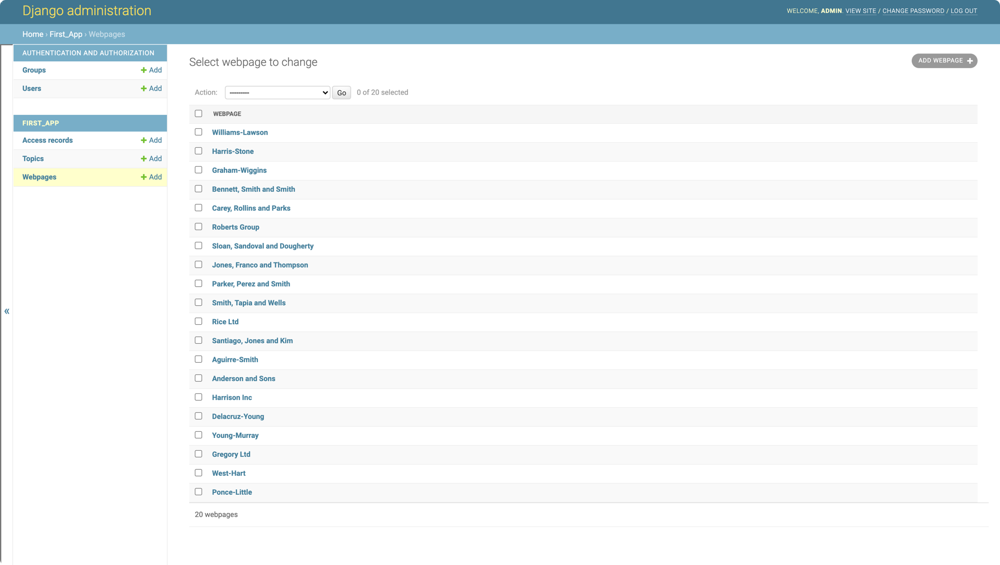

### Populating fake data

- To populate fake data run the script
```bash
$ python populate_first_app.py                  
Populating the databases...Please Wait
Populating Complete
```

- Now again run the server 

