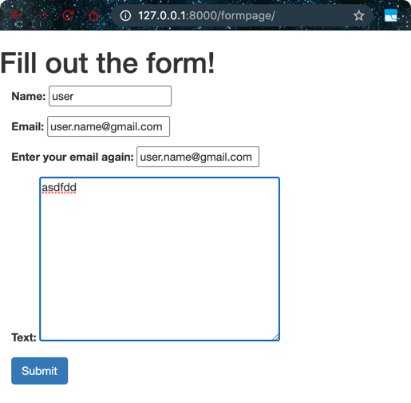
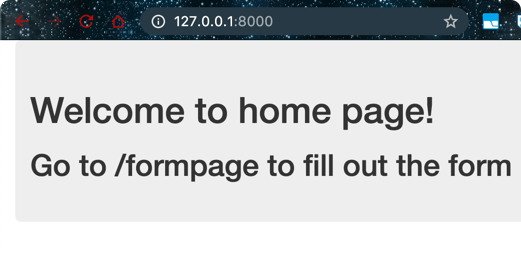

```bash
$ django-admin startproject basicforms
```

```bash
$ django-admin startapp basicapp
```

```bash
$ mkdir -p templates/basicapp
$ touch templates/basicapp/index.html
```

- add following to `index.html`

```html
<!DOCTYPE html>
<html>
  <head>
    <meta charset="utf-8">
    <title>HOME</title>
    <link rel="stylesheet" href="https://maxcdn.bootstrapcdn.com/bootstrap/3.3.7/css/bootstrap.min.css" integrity="sha384-BVYiiSIFeK1dGmJRAkycuHAHRg32OmUcww7on3RYdg4Va+PmSTsz/K68vbdEjh4u" crossorigin="anonymous">

  </head>
  <body>
    <div class="container">
      <div class="jumbotron">
        <h1>Welcome to home page!</h1>
        <h2>Go to /formpage to fill out the form</h2>
      </div>
    </div>

  </body>
</html>

```

- add following to form_page.html
```html
<!DOCTYPE html>
<html>
  <head>
    <meta charset="utf-8">
    <title>Forms</title>
    <link rel="stylesheet" href="https://maxcdn.bootstrapcdn.com/bootstrap/3.3.7/css/bootstrap.min.css" integrity="sha384-BVYiiSIFeK1dGmJRAkycuHAHRg32OmUcww7on3RYdg4Va+PmSTsz/K68vbdEjh4u" crossorigin="anonymous">
  </head>
  <body>

    <h1>Fill out the form!</h1>
    <div class="container">
      <form method="POST">
          {{form.as_p}}
          
        <input type="submit" class="btn btn-primary" value="Submit">
      </form>


    </div>

  </body>
</html>
```

- edit the settings.py file and add
```python
from pathlib import Path
import os

# Build paths inside the project like this: BASE_DIR / 'subdir'.
BASE_DIR = Path(__file__).resolve().parent.parent
TEMPLATE_DIR = os.path.join(BASE_DIR,'templates')

INSTALLED_APPS = [
    'django.contrib.admin',
    'django.contrib.auth',
    'django.contrib.contenttypes',
    'django.contrib.sessions',
    'django.contrib.messages',
    'django.contrib.staticfiles',
    'basicapp'
]

TEMPLATES = [
    {
        'BACKEND': 'django.template.backends.django.DjangoTemplates',
        'DIRS': [TEMPLATE_DIR, ],
        'APP_DIRS': True,
        'OPTIONS': {
            'context_processors': [
                'django.template.context_processors.debug',
                'django.template.context_processors.request',
                'django.contrib.auth.context_processors.auth',
                'django.contrib.messages.context_processors.messages',
            ],
        },
    },
]
```

- Now start creating forms inside basicapp
```bash
$ touch basicapp/forms.py            
```

```python
from django import forms
from django.core import validators


class FormName(forms.Form):
    name = forms.CharField()
    email = forms.EmailField()
    verify_email = forms.EmailField(label='Enter your email again:')
    text = forms.CharField(widget=forms.Textarea)

    def clean(self):
        all_clean_data = super().clean()
        email = all_clean_data['email']
        vmail = all_clean_data['verify_email']

        if email != vmail:
            raise forms.ValidationError("MAKE SURE EMAILS MATCH!")
```

- Now add to views.py
```python
from django.shortcuts import render
from . import forms
# Create your views here.

def index(request):
    return render(request,'basicapp/index.html')

def form_name_view(request):
    form = forms.FormName()

    if request.method == 'POST':
        form = forms.FormName(request.POST)

        if form.is_valid():
            # DO SOMETHING CODE
            print("VALIDATION SUCCESS!")
            print("NAME: "+form.cleaned_data['name'])
            print("EMAIL: "+form.cleaned_data['email'])
            print("TEXT: "+form.cleaned_data['text'])

    return render(request,'basicapp/form_page.html',{'form':form})

```

- add routes to `urls.py`
```python
from django.conf.urls import url
from django.contrib import admin
from django.urls import path
from basicapp import views

urlpatterns = [
    url(r'^$', views.index, name='index'),
    path('admin/', admin.site.urls),
    url(r'^formpage/', views.form_name_view, name='form_name')
]
```

- Now run the server and check






- You can see the post method result on the console output

